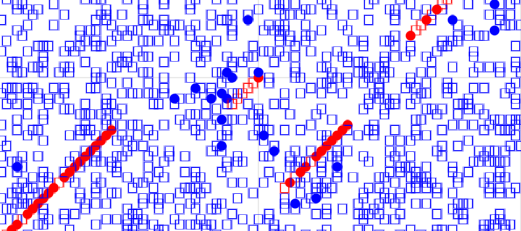

# ABM microtubule dynamics

This repository contains Julia skripts to model and test the dynamical instabilty of protofilaments of Microtubules in silicio.

The model is an Agent Based Model with a two dimensional periodic gridspace.

### Dependencies :
Julia Version 1.6.2
 Packages: 
 
    - Agents v4.5.6
    - DrWatson v2.7.0
    - Distributions v0.25.21
    - DataFrames v1.2.2
    - StatsBase v0.33.12
    - Statistics

For Plotting: 

	- GLMakie v0.4.7
	- InteractiveDynamics v0.17.3

### Agents 
 
The agents, representing α-& β- tubulin dimers, are implemented by a
mutable struct tubulin <: AbstractAgent
containing the Fields:

    - id::Int64
    - pos::Tuple{Int64, Int64}
    - polym::Int64
    - GDP::Bool

Supertype Hierarchy:
      
      tubulin <: AbstractAgent <: Any
    
see `agent.jl`


    
### Model Initialisation

Model intialisation is done by running the `init.jl` script to load the initialize() function

The Output of the initialize function is the model at timestep zero T = 0 :


### Model

The Model itself is a struct from the Agents.jl package.

`AgentBasedModel{GridSpace{2, true, Nothing}, tubulin, typeof(Agents.Schedulers.randomly), Dict{Symbol, Any}, Random.MersenneTwister} <: Any`

Fields

	- space::GridSpace{2, true, Nothing}
	- agents::Dict{Int64, tubulin}
	- scheduler::typeof(Agents.Schedulers.randomly)
	- properties::Dict{Symbol, Any}
	- rng::Random.MersenneTwister
	- maxid::Base.RefValue{Int64}

### Model Properties :

    - Gridsize::Tuple{Int,2}
    - Number of agents::tubulin
    - Number of Seeding Points
    
   Random (Binomial) distributed:
    
    - Polimerization rate ,p
    - Hydrolisation rate , p
    - Depolymerisation rate_GTP
    - Depolymerisation rate_GDP
    

  
### Stepping rules


Stepping rules for the model are created by running the `modelstep.jl` script

The modelstep! - function accepts a model struct as input and calculates a set of binomial disributions for each model-step using the parameters in the model properties as probabilities. 

Stepping rules for the agents are created by running the `agentstep.jl` script. 
At the moment all seedingpoints grow into the same direction (x-1,y-1).


 
### Run a single Simulation

To run a Simulation first call initialize to create the model:

```
model=initialize(; Nstarts= 5,
        periodic= true,
        numagents = 2000,
        griddims=(100,100), 
        p_polym=0.8,
        p_hyd= 0.03,
        p_depolym_GTP=0,
        p_depolym_GDP=0.3) 

```

### Data collection 

To collect data during simulation two dataframes are used:
 _adata_ contains the agents data, while
 _mdata_ holds model values such as shared or summarised values for all agents

array elements can be symbols or functions (ie sum, mean counts, or see anlayze functions for specific functions) 


```
mdata = [mean_MT_size,sd_MT_size,:p_hyd]
adata = [:pos, :polym, :GDP]
```

By calling run! with below arguments the model progresses 200 steps and saves the simulated data to adata and mdata
```
run!(model,agent_step!,model_step!,200; adata, mdata)

```



     
<br>

### Interactive Simulation

With the interactive Simulation Packages InteractiveDynamics, GLMakie and DrWattson, the values in the model properties dict can be changed during simulation.

see `interactive.jl` 

### Parameter scan

### Ensemble models


```
models = [initialize(; Nstarts= 3,
        periodic= true,
        numagents = 1000,
        griddims=(100,100), 
        p_polym=0.70,
        p_hyd= x,
        p_depolym_GTP=0,
        p_depolym_GDP=y) for x in repeat(collect([0.01:0.015:0.06]...), 5)
       for y in repeat([0.03,0.12], 10) ];
```

