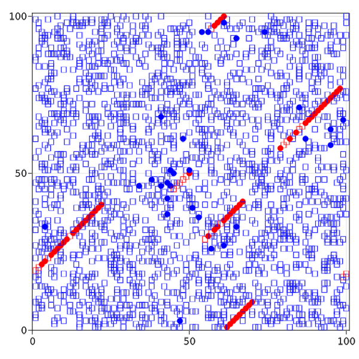

# ABM microtubule dynamics

This repository contains Julia skripts to model and test the dynamical instabilty of protofilaments of Microtubules in silicio.

The model is an Agent Based Model with a two dimensional periodic gridspace.

### Dependencies :
Julia Version 1.6.2
 Packages: 
 
    - Agents v4.5.6
    - DrWatson v2.7.0
    - Distributions v0.25.21
    - DataFrames v1.2.2
    - StatsBase v0.33.12
    - Statistics

For Plotting: MakieGL.jl

### Agents 
 
The agents, representing α-& β- tubulin dimers, are implemented by a
mutable struct tubulin <: AbstractAgent
containing the Fields:

    - id::Int64
    - pos::Tuple{Int64, Int64}
    - polym::Int64
    - GDP::Bool

Supertype Hierarchy:
      
      tubulin <: AbstractAgent <: Any
    
see file agent.jl


    
### Model Initialisation

Model intialisation is done by running the init.jl script to load the initialize() function

The Output of the initialize function is an populated model at timestep zero T = 0 :


### Model

The Model itself is a struct from the Agents.jl package.

`AgentBasedModel{GridSpace{2, true, Nothing}, tubulin, typeof(Agents.Schedulers.randomly), Dict{Symbol, Any}, Random.MersenneTwister} <: Any`

Fields

	- space::GridSpace{2, true, Nothing}
	- agents::Dict{Int64, tubulin}
	- scheduler::typeof(Agents.Schedulers.randomly)
	- properties::Dict{Symbol, Any}
	- rng::Random.MersenneTwister
	- maxid::Base.RefValue{Int64}

### Model Properties :

    - Gridsize::Tuple{Int,2}
    - Number of agents::tubulin
    - Number of Seeding Points
    
   Random (Binomial) distributed:
    
    - Polimerization rate ,p
    - Hydrolisation rate , p
    - Depolymerisation rate_GTP
    - Depolymerisation rate_GDP
    

     
<br>
  
### Stepping rules


Stepping rules for the model are created by running the `modelstep.jl` script

The modelstep! - function accepts a model struct as input and calculates a set of binomial disributions for each model-step using the parameters in the model properties as probabilities 

Stepping rules for the agents are created by running the `agentstep.jl` script 


### Ensemble models


```
models = [initialize(; Nstarts= 3,
        periodic= true,
        numagents = 1000,
        griddims=(100,100), 
        p_polym=0.70,
        p_hyd= x,
        p_depolym_GTP=0,
        p_depolym_GDP=y) for x in repeat(collect([0.01:0.015:0.06]...), 5)
       for y in repeat([0.03,0.12], 10) ];
```

